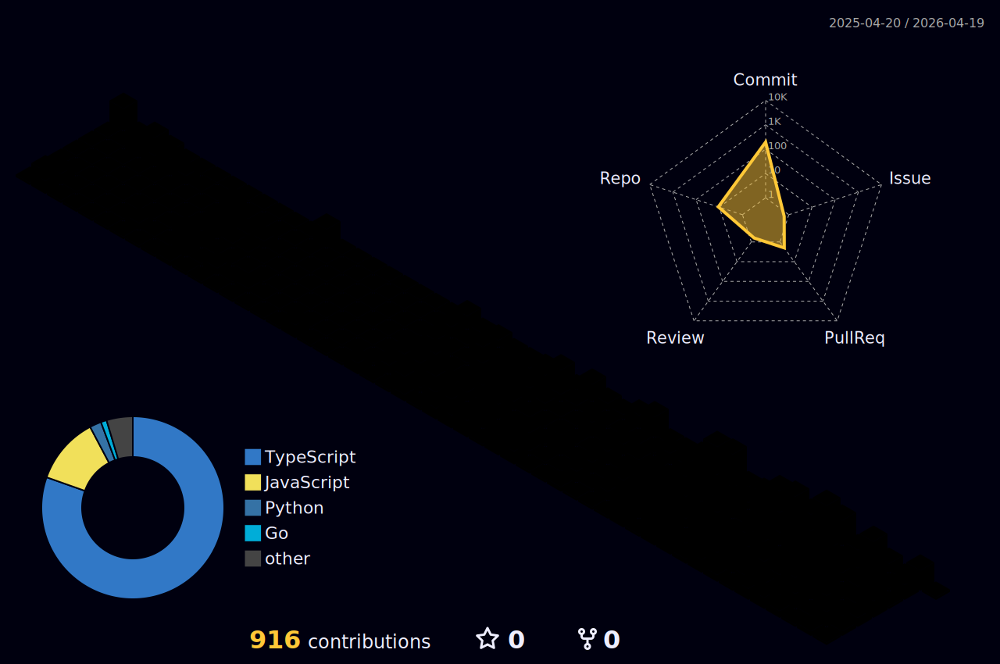

- 👋 Hi, I’m @kshitijakarsh
- 👀 I’m interested in web dev and web3
- 🌱 I’m currently learning Python and C
- 📫 How to reach me on twitter @kshitijakarsh and on linkedin @kshitijakarsh29
- 😄 Pronouns: He/Him

<!---
kshitijakarsh/kshitijakarsh is a ✨ special ✨ repository because its `README.md` (this file) appears on your GitHub profile.
You can click the Preview link to take a look at your changes.
--->
